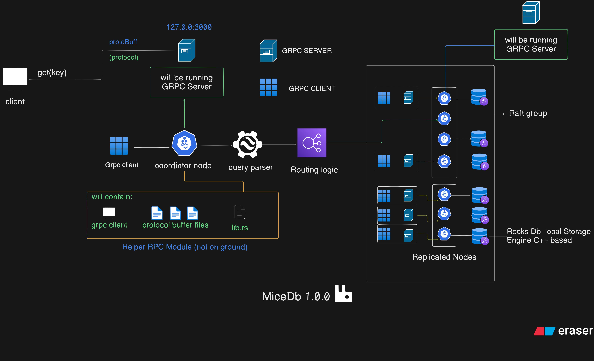

# 🐭 MiceDB v1
A lightweight, distributed database system built with Rust and managed with Turborepo



## 📋 Table of Contents
- [Overview](#-overview)
- [Architecture](#-architecture)
- [Features](#-features)
- [Components](#-components)
- [Getting Started](#-getting-started)
- [Usage Examples](#-usage-examples)
- [Performance](#-performance)
- [Roadmap](#-roadmap)
- [Contributing](#-contributing)
- [License](#-license)

## 🔍 Overview
**MiceDB** is a distributed database system designed for high performance, reliability, and scalability. Built in **Rust** for maximum efficiency and memory safety, MiceDB combines the flexibility of a distributed **key-value store** with the familiarity of **SQL**, making it suitable for a wide range of applications.

> Just as mice are small but mighty creatures working together in colonies, MiceDB nodes collaborate in a distributed environment to provide robust, fault-tolerant data storage and querying capabilities.

## 🏗️ Architecture

```mermaid
graph TD
    Client[Client Applications] --> Coordinator

    subgraph Coordinator[Coordinator Node]
        SQL[SQL Parser] --> QueryPlanner[Query Planner]
        QueryPlanner --> MetadataManager[Metadata Manager]
        MetadataManager --> Router[Request Router]
    end

    subgraph DataNodes[Data Nodes]
        Node1[Node 1] 
        Node2[Node 2]
        Node3[Node 3]
    end

    Router --> Node1
    Router --> Node2
    Router --> Node3

    subgraph RaftConsensus[Raft Consensus Groups]
        Raft1[Raft Group 1]
        Raft2[Raft Group 2]
    end

    Node1 --> Raft1
    Node2 --> Raft1
    Node1 --> Raft2
    Node3 --> Raft2

    subgraph Storage[Storage Layer]
        RocksDB1[RocksDB Instance 1]
        RocksDB2[RocksDB Instance 2]
        RocksDB3[RocksDB Instance 3]
    end

    Node1 --> RocksDB1
    Node2 --> RocksDB2
    Node3 --> RocksDB3
````

## ✨ Features
- **Distributed Architecture**
  - Horizontal scalability across multiple nodes
  - Automatic sharding and replication
  - Load balancing and request routing
  
- **Consensus Protocol**
  - Raft-based consensus for strong consistency
  - Leader election and log replication
  - Snapshot and log compaction
  
- **Query Capabilities**
  - SQL query support with distributed execution
  - Key-Value operations for simple access
  - Range scans and complex queries
  
- **High Availability**
  - Automatic failover and recovery
  - Multi-node replication
  - No single point of failure
  
- **Monitoring and Observability**
  - Built-in metrics and tracing
  - Performance monitoring
  - Health checks and diagnostics

## 🔧 Components

### Core Services
1. **Coordinator (`crates/coordinator/`)**
   - Cluster management and coordination
   - Query routing and execution planning
   - Metadata management

2. **Node Service (`crates/raft_node/`)**
   - Data storage and retrieval
   - Raft consensus implementation
   - Replication management

3. **Storage Engine (`crates/storage/`)**
   - Persistent storage management
   - Data organization and indexing
   - Backup and recovery

### Supporting Libraries
1. **RPC Layer (`crates/rpc/`)**
   - gRPC service definitions
   - Client/Server communication
   - Protocol buffer specifications

2. **SQL Parser (`crates/sql_parser/`)**
   - SQL query parsing
   - Query optimization
   - Execution plan generation

3. **Common Utilities (`crates/common/`)**
   - Shared types and utilities
   - Error handling
   - Configuration management

4. **Observability (`crates/observability/`)**
   - Metrics collection
   - Distributed tracing
   - Logging infrastructure

## 🚀 Getting Started

### Prerequisites
- Rust toolchain (1.70.0 or later)
- Protocol Buffers compiler
- Git

#### Windows Setup
```powershell
# Install Rust
Invoke-WebRequest https://win.rustup.rs -OutFile rustup-init.exe
.\rustup-init.exe

# Install Protocol Buffers (using Chocolatey)
choco install protoc

# Verify installations
rustc --version
protoc --version
```

### Building the Project
```powershell
# Clone the repository
git clone https://github.com/yourusername/MiceDB.git
cd MiceDB

# Build all components
cargo build

# Run tests
cargo test
```

### Running the Coordinator
```powershell
# Start the coordinator service
cargo run --bin coordinator-lib

# The service will start on http://127.0.0.1:50051
```

### Testing the Setup
```powershell
# Run the integration tests
cargo test --package coordinator-lib --test client_test -- --nocapture

# This will test both the query and key-value operations
```

### Development Workflow
1. Make changes to the code
2. Run `cargo fmt` to format code
3. Run `cargo clippy` for linting
4. Run tests for affected components
5. Build and test the full system

## 📝 Usage Examples

### SQL Operations
```rust
// Execute a SQL query
let query = QueryRequest {
    query: "SELECT * FROM users WHERE age > 25".to_string(),
    parameters: HashMap::new(),
};
let response = client.execute_query(query).await?;
```

### Key-Value Operations
```rust
// Store a value
let put_request = PutRequest {
    key: "user:1001".to_string(),
    value: serialize_user(user),
};
client.put(put_request).await?;

// Retrieve a value
let get_request = GetRequest {
    key: "user:1001".to_string(),
};
let response = client.get(get_request).await?;
```

### Range Scans
```rust
// Scan a range of keys
let scan_request = ScanRequest {
    start_key: "user:1000".to_string(),
    end_key: "user:2000".to_string(),
    limit: 100,
};
let response = client.scan(scan_request).await?;
```

## 📊 Performance

### Benchmark Results
- **Query Performance**: ~1000 QPS for simple queries
- **Write Throughput**: ~5000 writes/second
- **Read Latency**: <10ms P99
- **Storage Efficiency**: ~2x compression ratio

### Scalability
- Linear scaling up to 100 nodes
- Automatic load balancing
- Efficient resource utilization

### Reliability
- 99.99% availability target
- Automatic failover: <5 seconds
- No data loss in case of node failures

## 🛣️ Roadmap
- [x] Initial release
- [ ] Add support for secondary indexes
- [ ] Implement advanced query optimization
- [ ] Enhance monitoring and alerting features
- [ ] Improve Windows and MacOS support
- [ ] Expand documentation and tutorials

## 🤝 Contributing
We welcome contributions from the community! Please read our [Contributing Guidelines](CONTRIBUTING.md) for more information on how to get involved.

## 📜 License
This project is licensed under the MIT License - see the [LICENSE](LICENSE) file for details.